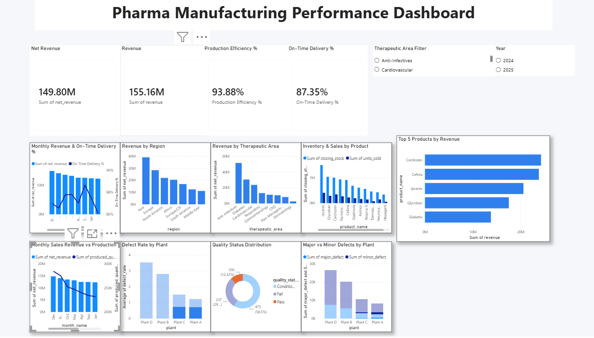

# Ipca-pharma-analytics
Pharma Manufacturing Performance Analytics Dashboard using Power BI, SQL and DAX

# IPCA Pharma Analytics

## 📊 Project Overview

An interactive Pharma Manufacturing Performance Dashboard built using Power BI, SQL, and DAX to analyze revenue, production efficiency, inventory, delivery performance, and product quality.

## 🛠️ Tools & Technologies

- Power BI
- SQL
- DAX
- CSV / Excel

## 📈 Dashboard Features

- Net Revenue & Revenue KPIs
- Production Efficiency Analysis
- On-Time Delivery Performance
- Revenue by Region
- Revenue by Therapeutic Area
- Inventory & Sales by Product
- Monthly Revenue vs Production
- Defect Rate by Plant
- Quality Status Distribution
- Major vs Minor Defect Analysis
- Top 5 Products by Revenue
- Year & Therapeutic Area Filters

## 🗄️ SQL Analysis

SQL was used to analyze and validate the sales data, including:

- Total Revenue
- Revenue by Region
- Revenue by Therapeutic Area
- Top 5 Products by Revenue
- Monthly Revenue
- Payment Status Analysis
- Customer Type Analysis

SQL queries are available in `ipca_pharma_analysis.sql`.

## 📷 Dashboard Preview

## 📁 Project Files

- `IPCA_Pharma_Analytics_.pbix` — Power BI dashboard file
- `ipca_pharma_analysis.sql` — SQL analysis queries
- Dashboard screenshot — Project preview

## 🎯 Key Skills Demonstrated

- Data Analysis
- Data Visualization
- Power BI Dashboard Development
- SQL Analysis
- DAX Measures
- KPI Development
- Business Performance Analysis
